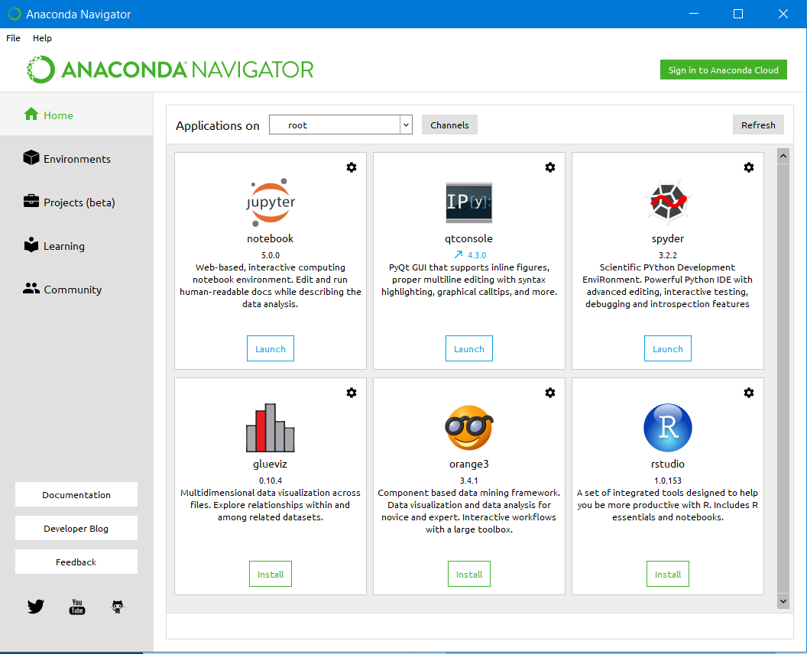
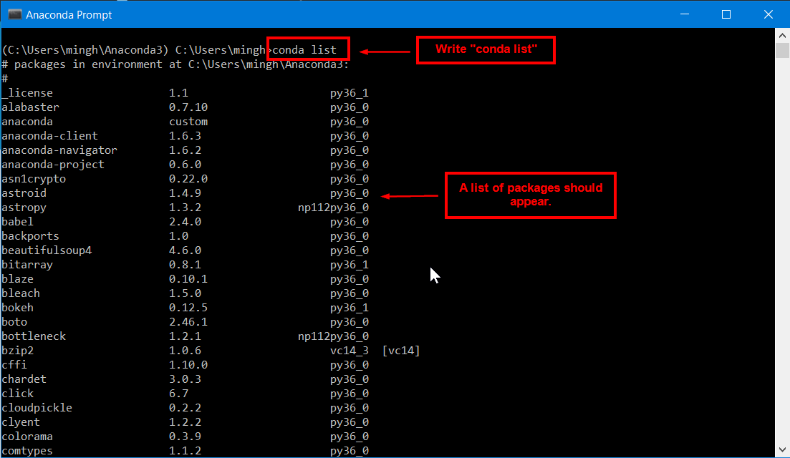

# Guide to install Anaconda Distribution
In this co-learning community, we would heavily be using Python. As such, we would be downloading Anaconda so that we are able to start on next week's lesson. Please closely follow the steps provided and do ask me (Michael) if there is any doubts.

**IF YOU BELONG TO ANY OF THESE GROUP PLEASE DON'T FOLLOW THIS STEPS.** 
1. [Windows] You previous installed python 2 or python 3.
2. [Windows/Mac] You previous installed Anaconda or Miniconda.

## Installation using Windows
Follow the instructions step-by-step from [this link](https://docs.continuum.io/anaconda/install/windows.html) 
[Installation Videos](https://www.youtube.com/watch?v=Vt6loGK9Adc)

## Installation using Mac
Follow the instructions step-by-step from [this link](https://docs.continuum.io/anaconda/install/mac-os.html) 
[Installation Videos until 6:02](https://www.youtube.com/watch?v=OOFONKvaz0A)

## Verifying Installation
After you have done installation, try to open “Anaconda Navigator”.  

If it works, you should be able to see this page. 

But just to be sure, open up "Anaconda Prompt".  

Once loaded, write the text, "conda list". It would show you all the packages that you have downloaded for python.  
