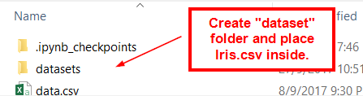
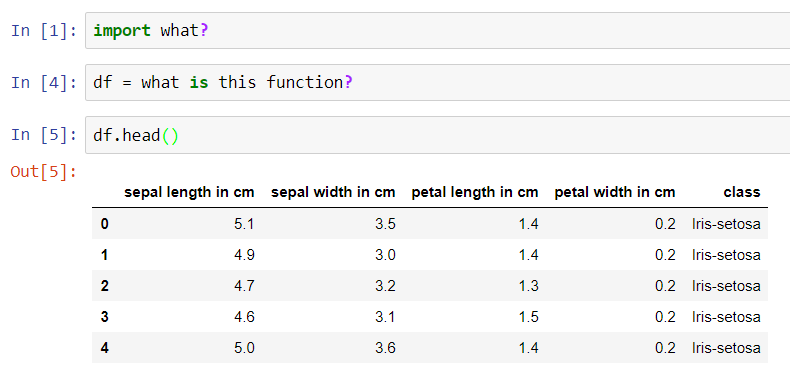

# Python for Data Analytics (2)
*Written by: Michael, Core Team 17*

## HELLO BEAUTIFUL.
I hope you have fun with the first python basic lesson. If you haven't complete the first [Python Basic Lesson](https://github.com/smubia/dap-2017/blob/master/Sem%201%20-%20Data%20Analytics/02%20-%20Python%20Basics/python-syntax.md), please do so before you embark on this lesson. This week, we would go more indepth into python, here are the following things that you would be learning.

- [ ] Dictionary
- [ ] Numpy
- [ ] Pandas
- [ ] Read & Write Files using Pandas

## Before we get started
**Remember!** 

**For those who just started programming,** I would like to tell you that the journey is going to be a tough, but believe me, it is going to be quite rewarding. Do note that this week would be very heavy for you guys . If you are struggling, may I suggest that you do the following - 1. State in the group that you wish to have a Python enrichment lesson over the weekends, 2. Request help from someone in the group, 3. Learn by yourself over the weekends.

**For people who think you already know python**, please use *this link (not released yet)* for a Python Checklist, if you able to complete everything without the need of googling, you may try either the mini projects or you can try more advanced topics of Data Analytics. But **PLEASE don’t neglect your group if they are able to understand or not occasionally.**

---

## Getting Started
### Learning Tips
- Watch in 1.25x or 1.5x speed to save time

### Icon Quick Reference 

:tv: = Video

:page_with_curl: = Article / Website / Book

:warning: = Warning! There might be some pre-requisite knowledge!

---

## Libraries and Modules
Do note that for you to install libraries inside of Anaconda, you are to do the following.
### First Methods
- img 1 (open up anaconda navigator)
- img 2 (search for it)
- img 3 (install it)

### Second Method (only if the library in the first method doesn't exist)
- img 1 (find the library online)
- img 2 (installing it using anaconda prompt)

## Dictionaries
:tv: https://www.youtube.com/watch?v=RVXIBZvg-W8
:tv: https://www.youtube.com/watch?v=YNRc6c0wUA8&list=PLQVvvaa0QuDe8XSftW-RAxdo6OmaeL85M&index=33

## Date and Time 
**Date Time may be quite confusing for beginners. Once you actually start trying it out, it may be tricky. **

:tv: **WATCH UNTIL 11:28** https://www.youtube.com/watch?v=eirjjyP2qcQ 
:tv: **WATCH UNTIL 6:16** https://www.youtube.com/watch?v=gu_J5FVO-8k

:page_with_curl: Date Time Resource. http://strftime.org/ *For a full list of strftime directives*

## Numpy 
**APMonitor.com** 
:tv: https://www.youtube.com/watch?v=mOZ0UCeuRX4  

**DataCamp** 
:tv: https://www.youtube.com/watch?v=AGzB7_vsLbE  
:tv: https://www.youtube.com/watch?v=rnw1qixAv1s  
:tv: https://www.youtube.com/watch?v=WUZlyG42ko0  

## Pandas Basics
Pandas is a very powerful library that we would be using in the future for data cleaning. In this set of tutorials would be used to help you understand the basics of Pandas, while in the next lesson we would explore data cleaning!

**Data School** 
:tv: https://www.youtube.com/watch?v=5_QXMwezPJE&list=PL5-da3qGB5ICCsgW1MxlZ0Hq8LL5U3u9y&index=2  
:tv: https://www.youtube.com/watch?v=zxqjeyKP2Tk&list=PL5-da3qGB5ICCsgW1MxlZ0Hq8LL5U3u9y&index=3  
:tv: https://www.youtube.com/watch?v=hSrDViyKWVk&list=PL5-da3qGB5ICCsgW1MxlZ0Hq8LL5U3u9y&index=4  
:tv: https://www.youtube.com/watch?v=0uBirYFhizE&index=5&list=PL5-da3qGB5ICCsgW1MxlZ0Hq8LL5U3u9y  
:tv: https://www.youtube.com/watch?v=gnUKkS964WQ&list=PL5-da3qGB5ICCsgW1MxlZ0Hq8LL5U3u9y&index=6  
:tv: https://www.youtube.com/watch?v=zY4doF6xSxY&index=7&list=PL5-da3qGB5ICCsgW1MxlZ0Hq8LL5U3u9y  
:tv: https://www.youtube.com/watch?v=2AFGPdNn4FM&list=PL5-da3qGB5ICCsgW1MxlZ0Hq8LL5U3u9y&index=8  
:tv: https://www.youtube.com/watch?v=YPItfQ87qjM&index=9&list=PL5-da3qGB5ICCsgW1MxlZ0Hq8LL5U3u9y  

## Pandas Read and Write Files
In this exercise, I want you to try to use Google to find the answers for this exercise. When you are doing data analytics in the future, you need to know how to read documentations and try to understand how to do certain functions. 

In the "Pandas Basics" videos, you will realised that he used a website to get his data. This time, I want you to get the data locally.
1. Download [this file](https://drive.google.com/open?id=0B4co3D7kCi9oSGFFdWd3YkdkdU0)
2. Create a new Folder in your "AnacondaProjects Folder" called "Datasets"
3. Place the data into the folder
3. Using Pandas, try to read the file and print the first 5 rows from the data file.

### Output

Output 1 | Output 2 
------------ | ------------- 
File Directory | Jupyter Notebook Output
 |  

## Additional Readings (Very Indepth)
:page_with_curl: https://www.tutorialspoint.com/python/python_dictionary.htm 
:page_with_curl: https://www.tutorialspoint.com/python/python_date_time.htm 

---

# Test Your Understanding!
This week, we would be 
## Numpy

## Pandas

---

# External Resources
If you manage to finish both web scrapping and tkinter resources last week, you can try this following external resources. Please do note that the external resources for week 1 is more applicable to Data Analytics than this week's external resources. If there is a need for more external help, please tell me or of the core team members. Happy Learning!

## Flask (Web Development)
Web Development is a very important tool that you would be using to display data projects or information. For python, they use many different kinds of frameworks to develop in Python, you may want to explore Django if you do not wish to use Flask. For this external resources, you would be learning HTML, CSS and JavaScript. (All of which is highly important).

If you are not sure whether to use Django or Flask, I would advice you to use Flask. Since it's is much more easier to learn and you would be able to learn about the basics of Web Development much quicker. 

Flask
:tv: https://www.youtube.com/watch?v=YNRc6c0wUA8&list=PLQVvvaa0QuDe8XSftW-RAxdo6OmaeL85M&index=33

Django 
:tv: https://www.youtube.com/playlist?list=PL6gx4Cwl9DGBlmzzFcLgDhKTTfNLfX1IK

## SQLLite (Simple Databases)
You can use SQLlite to understand about how to use databases without much implementation (setting up databases, downloading specific softwares, etc.) In addition, you can use the [SQLLiteBrowser](https://github.com/sqlitebrowser/sqlitebrowser/releases) to view the data in the database directly.

:tv: https://www.youtube.com/watch?v=o-vsdfCBpsU&list=PLQVvvaa0QuDezJh0sC5CqXLKZTSKU1YNo&index=1

