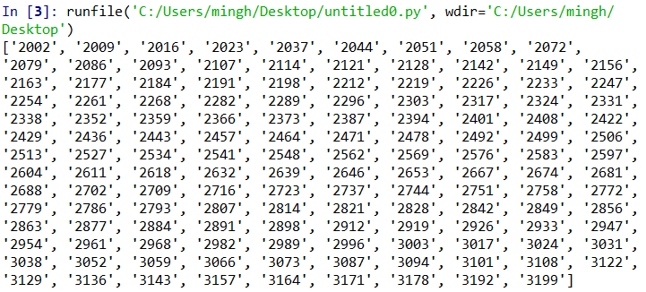
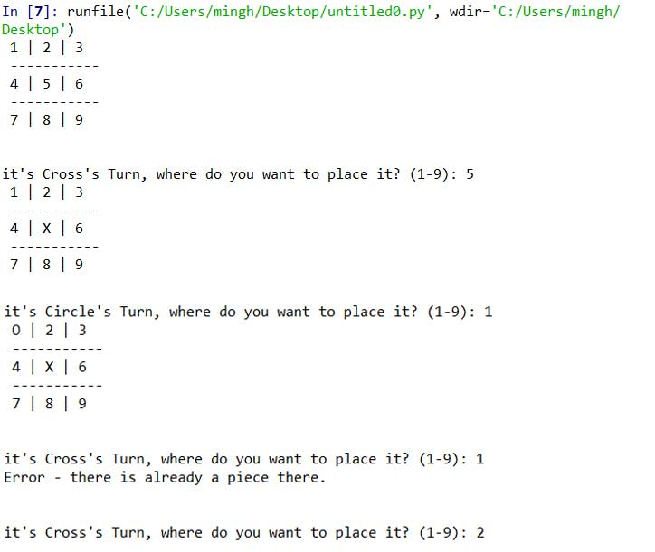
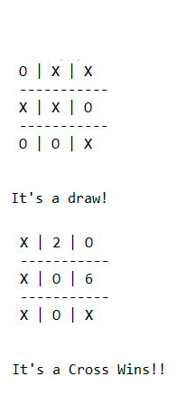
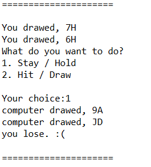
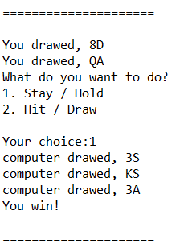
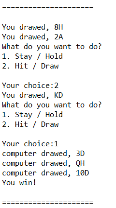
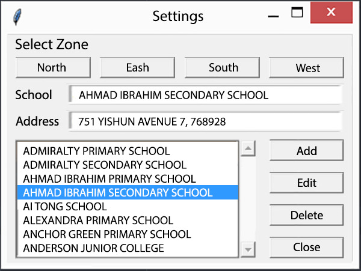

# Python for Data Analytics (1)
*Written by: Michael, Core Team 17*

## Welcome Message
Welcome my dear data associates. You would be embarking into the wonderful life of python! We hope that by the end of this course, you would be able to have achieve the following

- [ ] Basic Arithemtic Functions in Python
- [ ] Strings and Printing
- [ ] Understanding Variables and Datatypes
- [ ] Booleans and Comparisons
- [ ] Lists (basics)
- [ ] Conditional Statements
- [ ] Logical Operators
- [ ] Looping (For, While). 
- [ ] Creating you own Functions

## Before we get started
Make sure that you have installed Anaconda, or python. If you haven't please follow [this link](https://github.com/smubia/dap-2017/blob/master/Sem%201%20-%20Data%20Analytics/01%20-%20Basics%20of%20Analytics/anaconda-ipython.md) to get into the instructions for how to download Anaconda. Also note that for this course, we would primarily be using Spyder. However, this and next week would probably be the only time in which you guys would be using Spyder, and we would move into a much more "data-analytics" friendly development enviroment. 

**For those who just started programming,** I would like to tell you that the journey is going to be a tough, but believe me, it is going to be quite rewarding. Do note that this week would be very heavy for you guys . If you are struggling, may I suggest that you do the following - 1. State in the group that you wish to have a Python enrichment lesson over the weekends, 2. Request help from someone in the group, 3. Learn by yourself over the weekends.

**For people who think you already know python**, please use *this link (not released yet)* for a Python Checklist, if you able to complete everything without the need of googling, you may try either the mini projects or you can try more advanced topics of Data Analytics. But **PLEASE don’t neglect your group if they are able to understand or not occasionally.**

## Getting Started
### Learning Tips
- Watch in 1.25x or 1.5x speed to save time

### Icon Quick Reference 

:tv: = Video

:page_with_curl: = Article / Website / Book

:warning: = Warning! There might be some pre-requisite knowledge!

# Python Basics
For this week, we would be primarily using resources from 3 places, TheNewBoston, ProgrammingKnowledge and [Automating the Boring Stuff with Python](https://drive.google.com/open?id=0B4co3D7kCi9oQ1NyR0I1LTFGVVE) (please use you SMU google account). I would suggest that **the best resource for you to use, is actually ProgrammingKnowledge if you are relatively new to programming. **

## Learning Spyder ##
Before writing any code with Python, you first need to know how to use Spyder. You guys should know how to open up Spyder. But in case you forgot, go and run "Anaconda Navigator" and then run "Spyder". Go and view this simple video to understand what you need to know about Spyder and Python.

***Take note:*** For you to follow this tutorial, you need to use *print ("Hello, World")* instead of *print "Hello, World"*  
:tv: https://youtu.be/J5GevIHNctM?t=10m23s

## Basic Arithemtic Functions in Python

**ProgrammingKnowledge** 
:tv: https://www.youtube.com/watch?v=Lbs7vmx3YwU&index=2&list=PLS1QulWo1RIaJECMeUT4LFwJ-ghgoSH6n

**TheNewBoston** 
:tv: https://www.youtube.com/watch?v=hnxIRVZ0EyU&list=PL6gx4Cwl9DGAcbMi1sH6oAMk4JHw91mC_&index=2

**Automating the Boring Stuff with Python** 
:page_with_curl: pg 38 - 41

## Built-in Functions and Modules
**ProgrammingKnowledge** 
:tv: https://www.youtube.com/watch?v=GTpl5yq3bvk&list=PLS1QulWo1RIaJECMeUT4LFwJ-ghgoSH6n&index=4

## Strings and Printing
**ProgrammingKnowledge** 
:tv: https://www.youtube.com/watch?v=xBDGux27Qrg&list=PLS1QulWo1RIaJECMeUT4LFwJ-ghgoSH6n&index=6

**TheNewBoston** 
:tv: https://www.youtube.com/watch?v=nefopNkZmB4&list=PL6gx4Cwl9DGAcbMi1sH6oAMk4JHw91mC_&index=3

**Automating the Boring Stuff with Python** 
:page_with_curl: pg 41 - 45

## Understanding Variables and Datatypes
**ProgrammingKnowledge** 
:tv: https://www.youtube.com/watch?v=YtX-Rmoea0M&index=3&list=PLS1QulWo1RIaJECMeUT4LFwJ-ghgoSH6n

**TheNewBoston** 
:tv: https://www.youtube.com/watch?v=YbipxqSKx-E&index=4&list=PL6gx4Cwl9DGAcbMi1sH6oAMk4JHw91mC_

**Automating the Boring Stuff with Python** 
:page_with_curl: pg 45 - 52

## Lists (basics)
**ProgrammingKnowledge** 
:tv: https://www.youtube.com/watch?v=dV9K6QMrIn4&list=PLS1QulWo1RIaJECMeUT4LFwJ-ghgoSH6n&index=7 
:tv: https://www.youtube.com/watch?v=fDoYwL90WUg&list=PLS1QulWo1RIaJECMeUT4LFwJ-ghgoSH6n&index=8

**TheNewBoston** 
:tv: https://www.youtube.com/watch?v=1yUn-ydsgKk&list=PL6gx4Cwl9DGAcbMi1sH6oAMk4JHw91mC_&index=5

**Automating the Boring Stuff with Python** 
:page_with_curl: pg 103 - 109 (stop before Using for loops with lists)

## Conditional Statements (If-elif-else)
**ProgrammingKnowledge** 
:tv: https://www.youtube.com/watch?v=-nJvt_7l-sk&list=PLS1QulWo1RIaJECMeUT4LFwJ-ghgoSH6n&index=9 
:tv: https://www.youtube.com/watch?v=1QfPTboc1Pw&index=10&list=PLS1QulWo1RIaJECMeUT4LFwJ-ghgoSH6n 
:tv: https://www.youtube.com/watch?v=YuVcBm_J2js&list=PLS1QulWo1RIaJECMeUT4LFwJ-ghgoSH6n&index=11

**TheNewBoston** 
:tv: https://www.youtube.com/watch?v=bk22K1m0890&list=PL6gx4Cwl9DGAcbMi1sH6oAMk4JHw91mC_&index=7 
:tv: https://www.youtube.com/watch?v=xRIzPZlei9I&index=13&list=PL6gx4Cwl9DGAcbMi1sH6oAMk4JHw91mC_

**Automating the Boring Stuff with Python** 
:page_with_curl: pg 56 - 69 (stop before while loop)

## Looping (For, While). 
**ProgrammingKnowledge** 
:tv: https://www.youtube.com/watch?v=26VtIlzEcmU&list=PLS1QulWo1RIaJECMeUT4LFwJ-ghgoSH6n&index=12

**TheNewBoston** 
:tv: https://www.youtube.com/watch?v=llguiJHU0kk&index=8&list=PL6gx4Cwl9DGAcbMi1sH6oAMk4JHw91mC_ 
:tv: https://www.youtube.com/watch?v=Neir-vgPyxw&index=9&list=PL6gx4Cwl9DGAcbMi1sH6oAMk4JHw91mC_

**Automating the Boring Stuff with Python** 
:page_with_curl: pg 69 - 72 (stop before break) 
:page_with_curl: pg 77 - 81 (stop before importing Modules) 
:page_with_curl: pg 110

## Creating you own Functions
**ProgrammingKnowledge** 
:tv: https://www.youtube.com/watch?v=TkBLZk_hV5Y&list=PLS1QulWo1RIaJECMeUT4LFwJ-ghgoSH6n&index=13

**TheNewBoston** 
:tv: https://www.youtube.com/watch?v=j2xhtI0WTew&list=PL6gx4Cwl9DGAcbMi1sH6oAMk4JHw91mC_&index=12

**Automating the Boring Stuff with Python** 
:page_with_curl: pg 85 - 90 (stop before global scope)

## Python Checklist
To check your understanding of python, I have created a [Python checklist in Juypter Notebook.](https://drive.google.com/open?id=0B4co3D7kCi9oX3I0dk1vZU0xcVk) (please use you SMU google account). If you are able to complete the checklist, you are ready to move onto the mini projects.

**To run this, you need to open Jupyter Notebook to open up the file**

## Additional Readings (Very Indepth)
:page_with_curl: https://www.tutorialspoint.com/python/python_basic_syntax.htm 
:page_with_curl: https://www.tutorialspoint.com/python/python_variable_types.htm 
:page_with_curl: https://www.tutorialspoint.com/python/python_basic_operators.htm 
:page_with_curl: https://www.tutorialspoint.com/python/python_decision_making.htm 
:page_with_curl: https://www.tutorialspoint.com/python/python_loops.htm 
:page_with_curl: https://www.tutorialspoint.com/python/python_numbers.htm 
:page_with_curl: https://www.tutorialspoint.com/python/python_strings.htm 
:page_with_curl: https://www.tutorialspoint.com/python/python_lists.htm 
:page_with_curl: https://www.tutorialspoint.com/python/python_functions.htm

# Mini Projects
## Project 1 (Easy) - Guess the number
In this mini project, you would be guessing a number between 1 to 20.
1. Generate a random number between 1 to 20. (You may need to google how to generate random numbers using google)
2. The computer waits for an input. (you may need to google how to input values using google)
3. If the input matches the random number, the program stops.

Output |
------------ |
 |
 

**Concepts used: While loops, if-else statements, random number generation, value input.**
  

## Project 2 (Easy) - Mutliples of 5 & 7
In this mini project, Write a program which will find all such numbers which are divisible by 7 but are not a multiple of 5,
between 2000 and 3200 (both included). The numbers obtained should be printed in a comma-separated sequence on a single line.

1. Generate a random number between 1 to 20. (You may need to google how to generate random numbers using google)
2. The computer waits for an input. (you may need to google how to input values using google)
3. If the input matches the random number, the program stops.

Output |
------------ |
  |

**Concepts used: While loops, if-else statements, random number generation, value input.**
  
## Project 3 (Easy) - Rock, Paper, Scissors
In this mini project, you would be playing rock, paper and scissors with a computer
1. The computer waits for an input. (you may need to google how to input values using google)
2. You have to choose between "Rock", "Paper" or "Scissors"
3. If a different values appears, you are to return an error message "That's not a valid play. Check your spelling!"
4. Generate the computer generate a random number between 1 - 3. Where 1 = Rock, 2 = Paper and 3 = Scissors.
5. Return the desired output, if you lose or tie, continue playing. Only if you win, then you stop playing.

Output |
------------ |
  |

**Concepts used: While loops, if-else statements, random number generation, value input, Error Validation.**
  
## Project 4 (Moderate) - Tic Tac Toe
In this mini project, you would be playing Tic Tac Toe with 2 players. Each player will take turns to play.
1. When the program starts, it asks you to select a number from 1 - 9, where each value corresponds to a number on the tic-tac-toe board.
2. After you select where you want to place the first piece, you give to your friend to select his piece.
3. The game ends when all pieces are placed or a winner emerges.

Output 1 | Output 2 
------------ | ------------- 
  |  

  
## Project 5 (Hard) - BlackJack
In this mini project, you would be playing Blackjack with a computer. This thing took me 2 hours to complete, and is **highly not recommended** for beginners
1. At the start, 2 cards are drawn at random
2. You are then given the option to draw or to stay.
3. Choose draw, you are then given the option to draw again or stay.
4. Once you choose to stay, the computer will draw cards until it is above 16.
5. The winner is determined by the higher value that is not more than 21.

Output 1 | Output 2 | Output 3
------------ | ------------- | -------------
 |  | 
  
# External Resources
## Web Scrapping (Recommended)
Web Scrapping is an important concept that is most likely going to be covered at the later part of the course. Howver, if you do want to learn web scrapping in your free time. You can follow this person's tutorials. The library which you would be using is BeautifulSoup4.

:tv: https://www.youtube.com/watch?v=r_xb0vF1uMc&list=PL5-da3qGB5IDbOi0g5WFh1YPDNzXw4LNL&index=1

## GUI Creation 
GUI Creation is very important for some organisations, which internet or the need to spend money for a website may be an issue. As such, you can create a GUI to serve a certain need. An example of Gui is as follows:

>
>
>
>
>
>
>
>
>

You can follow this person's tutorials. The library which you would be using is Tkinter. A simple mini project on Tkinter that you can do is a basic calculator.

:tv: https://www.youtube.com/watch?v=RJB1Ek2Ko_Y&list=PL6gx4Cwl9DGBwibXFtPtflztSNPGuIB_d